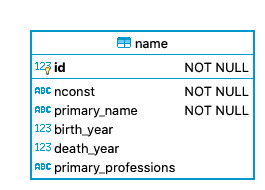
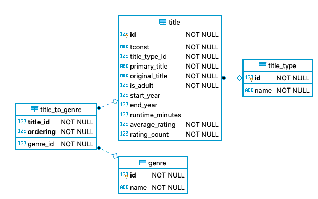
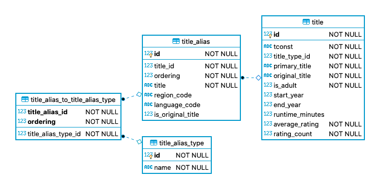
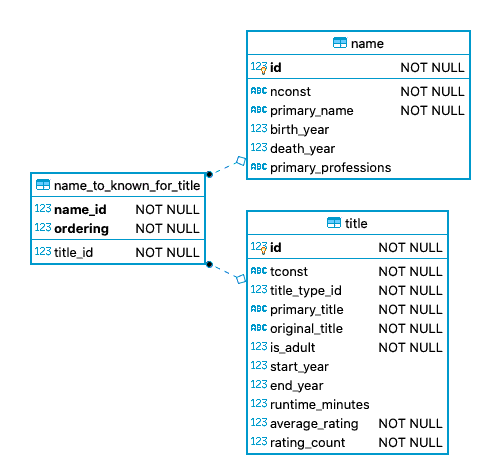

# Data model

The tables created by pimdb are part of two different data models:

1. The dataset model as created by `pimdb transfer`.
2. The normalized model as created by `pimdb build` and derived from
   the tables of the dataset model.

The main difference is that the tables dataset model are basically a copy of
the flat datesets, while the normalized model has normalized relations and
several data quality and naming issues cleaned up.

This chapter describes both kinds of tables and gives examples on how to
query them.

## Dataset tables

The data are transferred "as is" except that **duplicates** are skipped. Most
of the time the datasets do not include duplicates, but every once in a while
they do, especially `names.basic.tsv.gz`.

You can find a short description of the datasets and the available fields at
the page about the [IMDb datasets](https://www.imdb.com/interfaces/).

Dataset tables have their names in PascalCase, for example `TitleBasics`
while the field names preserve the original camelCase, for
example `runtimeMinutes`.

Typically queries will start from either `NameBasics` or `TitleBasics`
and from there join into other tables. Data about names are connected with the
field `nconst` while data about titles use `tconst`. The only exception
is `TitleAkas` which has its `tconst` stored in `titleId`.

The tables have **no foreign key relations** to other tables for the following
reasons:

1. At the time of this writing, the datasets include minor inconsistencies
   that would break the data import due to unresolvable foreigen key
   relations.
2. Without foreign key relations is easily possible to
   `pimdb transfer` multiple tables in parallel.

Here is an example query that lists all the titles directed by Alan Smithee:

```sql
-- Example query: titles directed by Alan Smithee
select
    TitleBasics.primaryTitle as title,
    TitleBasics.startYear as year,
    TitleBasics.titleType as type
from
    TitleCrew
    join TitleBasics on
        TitleBasics.tconst = TitleCrew.tconst
    join NameBasics on
        find_in_set(NameBasics.nconst, TitleCrew.directors) > 0
where
    NameBasics.primaryName = 'Alan Smithee'
order by
    TitleBasics.startYear,
    TitleBasics.primaryTitle
```

The tables have very few indexes, typically only the key fields `nconst` and
`tconst` are indexed. So SQL joins on these fields should be reasonably
fast while for example SQL `where` conditions on `name` fields are pretty
slow.

You can add your own indexes at any time but be aware that too many indexes
might slow down future runs of `pimdb transfer`. Also they take more
space. And finally, if you use the command line option `--drop`, they are
removed and you will have to create them again.

## Normalized tables

While the dataset table are already sufficient for many simple queries, they
have several issues that normalized tables created with `pimdb build`
solve:

1. 1:N relations are stored in relation tables instead of comma separated
   `varchar` fields. For exaple, compare `NameBasics.knownForTitles`
   with `name_to_known_for_title`.
2. Inconsistent or non-existent references are removed and replaced by clean
   foreign key relationships.
3. SQL joins can be performed more efficiently using integer `id` fields
   instead of the `varchar` fields `nconst` and `tconst`. If needed,
   the latter are still available from `name.nconst` and `title.tconst`.
4. Ratings from `TitleRatings` (dataset: `title.ratings`) have been
   merged with `TitleBasics` into `title.average_rating` and
   `title.rating_count`. For titles that have no rating, these values are
   both 0.

Normalized tables are named using snake_case, for example `title_alias`,
and so are fields in these tables, for example `primary_title`. This makes
it easy to know whether a table is a dataset or normalized.

Let's take a look at these tables and how they are related to each other.

First, there is `name` which contains information about persons that one
way or another contributed to a title:



Next, there is `title` which is somewhat similar to `name` but contains
details about titles. It also has relation to `title_type`, which is a
**key table** containing all available title types, for example: "movie",
"tvEpisode" and so on. Apparently there are only a few different such types,
so this table is pretty small. Similarly there is a table `genre` with
names like "Action", "Sci-Fi", "Documentary" and so on. Because a title can
have multiple genres, they are connected in a **relation table**
`title_to_genre` in order to represent this M:N relation.



As example here is a query to list the genres of a certain title:

```sql
-- Example query: genres of "Wyrmwood: Road if the Dead"
select
    title.tconst,
    title.primary_title,
    genre.name as "genre.name"
from
    title
    join title_to_genre on
        title_to_genre.title_id = title.id
    join genre on
        genre.id = title_to_genre.genre_id
where
    title.tconst = 'tt2535470'
```

The output would be:

| tconst    | primary_title              | genre.name |
| --------- | -------------------------- | ---------- |
| tt2535470 | Wyrmwood: Road of the Dead | Action     |
| tt2535470 | Wyrmwood: Road of the Dead | Comedy     |
| tt2535470 | Wyrmwood: Road of the Dead | Horror     |

Similarly, a title be known under different names, for example depending on
the country or media released on. A `title_alias` is related to exactly one
title and can have multiple aliases. They are connect with the relation table
`title_to_alias` and have a certain `title_alias_type` like "dvd", "tv" or
"festival".



And finally names and titles can be related to each other. A simple variant are
the titles a person is known for:



As example, here is a query that lists the titles Alan Smithee is known for:

```sql
-- Example query: titles Alan Smithee is known for
select
    title.primary_title,
    title.start_year
from
    name_to_known_for_title
    join name on
        name.id = name_to_known_for_title.name_id
    join title on
        title.id = name_to_known_for_title.title_id
where
    name.primary_name = 'Alan Smithee'
```

More details on how a person contributed in the makeing of a title are avaiable
via the `participation` table, which connects names and titles with a
`profession` like "actress" or "director". For professions like "actor" and
"actress" there also is information on which character(s) they played in a
certain title using the relation table `participation_to_character` and the
key table `character`. Unlike most other key table that have only a couple of
entries, `character` has about two million.


Note that not everyone actually played a character as a title typically has
many supporting roles. Depending on the goals of your query you might have to
use a `left join` for `participation_to_character`.

```sql
-- Example query: movies with a character named "James Bond" and the respective actor
select
    title.primary_title as movie,
    title.start_year as year,
    name.primary_name as actor
from
    title_character
    join title on
        title.id = title_character.title_id
    join name_to_title_character on
        name_to_title_character.title_character_id = title_character.id
    join name on
        name.id = name_to_title_character.name_id
where
    title_character.name = 'James Bond'
order by
    title.start_year,
    title.primary_title
```
